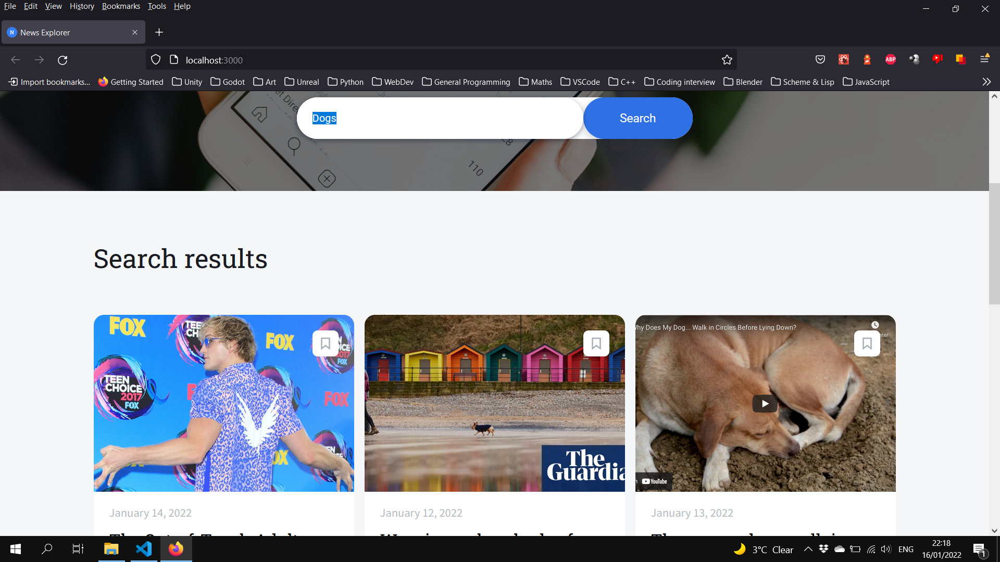
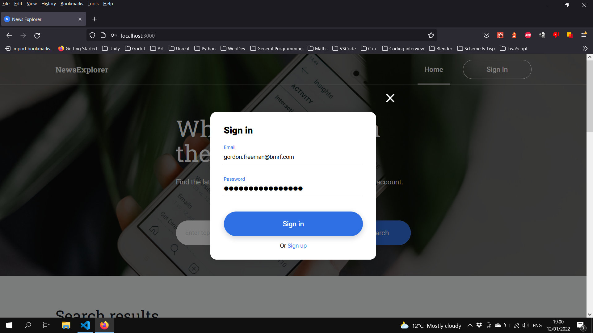
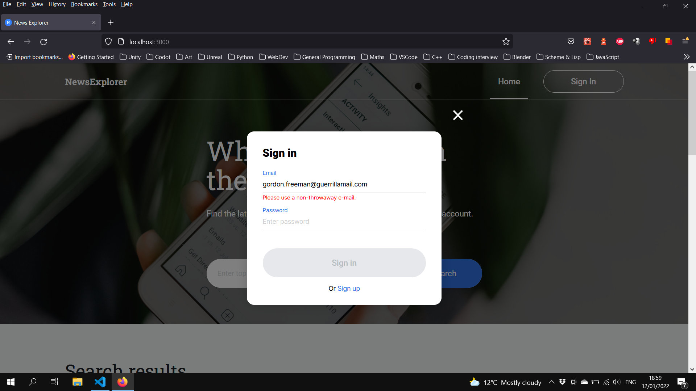
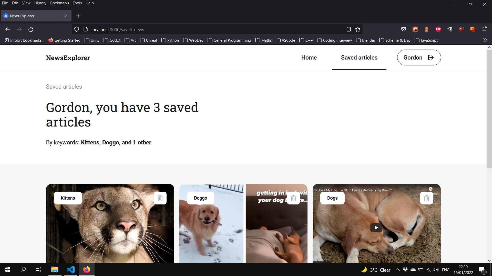

# News Explorer Frontend

## Screenshots
<figure>

  <figcaption><b>The main screen.</b></figcaption>
</figure>
  
<figure>

  <figcaption><b>Logging in with valid credentials.</b></figcaption>
</figure>
  
<figure>

  <figcaption><b>Logging in with an invalid e-mail.</b></figcaption>
</figure>
  
<figure>

  <figcaption><b>The saved articles screen.</b></figcaption>
</figure>
