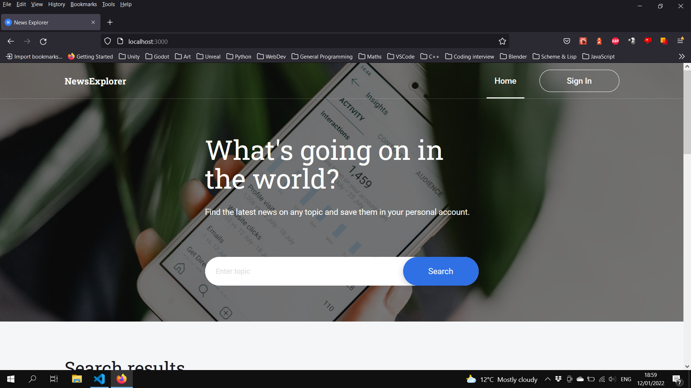

# News Explorer Frontend

The frontend is currently under heavy development and can not yet connect to the backend or communicate with the News API.

## Notes for Testing & Usage

- Any credentials that pass validation can be used to log-in (i.e. valid e-mail & password).
- Any valid input in the sign up form will result in a successful registration message.
- Throwaway e-mails (i.e. addresses associated with known temporary e-mail providers) are _**not**_ considered valid.

## Screenshots

<figure>

<figcaption>The main screen.</figcaption>
</figure>
<figure>

<figcaption>Logging in with valid credentials.</figcaption>
</figure>
<figure>

<figcaption>Logging in with an invalid e-mail.</figcaption>
</figure>
